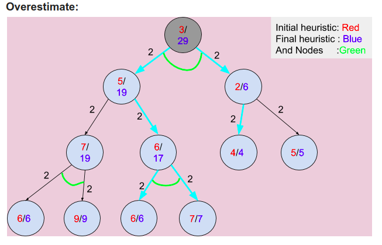
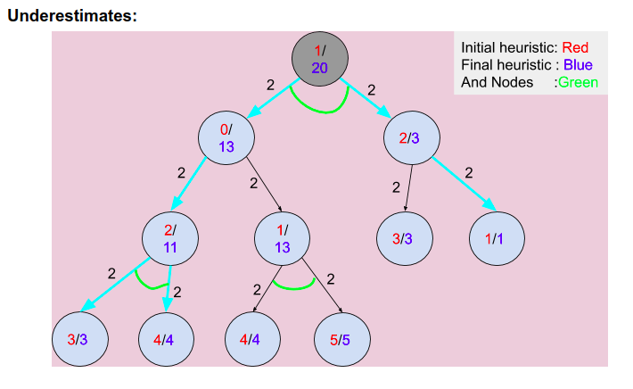

# AO\* algorithm group 5

1. data = h(n)
2. sets = count of individal OR nodes + joint AND nodes are counted as 1
3. The Data input follows a Pre_Order Traversal
4. Types of prompts:
   1. Enter data of node --> Enter h(n)
   2. Enter number of sets for value 'data_value_of_node' --> Enter no. OR nodes + joint AND nodes
   3. Enter number of AND nodes for branch no. 'ith branch' of 'data_value_of_node' --> In the case the node is AND node/set

## Example1 in Report: Overestimate

### Run as : python3 ao_star.py

### inputs:

1. Prompt: Enter data of node :
   Input: 3
2. Prompt: Enter number of sets for value 3 :
   Input: 1
3. Prompt: Enter number of AND nodes for branch no. 1 of 3 :
   Input: 2
4. Prompt: Enter data of node :
   Input: 5
5. Prompt: Enter number of sets for value 5 :
   Input: 2
6. Prompt: Enter number of AND nodes for branch no. 1 of 5 :
   Input: 1
7. Prompt: Enter data of node :
   Input: 7
8. Prompt: Enter number of sets for value 7 :
   Input: 1
9. Prompt: Enter number of AND nodes for branch no. 1 of 7 :
   Input: 2
10. Prompt: Enter data of node :
    Input: 6
11. Prompt: Enter number of sets for value 6 :
    Input: 0
12. Prompt: Enter data of node :
    Input: 9
13. Prompt: Enter number of sets for value 9 :
    Input: 0
14. Prompt: Enter number of AND nodes for branch no. 2 of 5 :
    Input: 1
15. Prompt: Enter data of node :
    Input: 6
16. Prompt: Enter number of sets for value 6 :
    Input: 1
17. Prompt: Enter number of AND nodes for branch no. 1 of 6 :
    Input: 2
18. Prompt: Enter data of node :
    Input: 6
19. Prompt: Enter number of sets for value 6 :
    Input: 0
20. Prompt: Enter data of node :
    Input: 7
21. Prompt: Enter number of sets for value 7 :
    Input: 0
22. Prompt: Enter data of node :
    Input: 2
23. Prompt: Enter number of sets for value 2 :
    Input: 2
24. Prompt: Enter number of AND nodes for branch no. 1 of 2 :
    Input: 1
25. Prompt: Enter data of node :
    Input: 4
26. Prompt: Enter number of sets for value 4 :
    Input: 0
27. Prompt: Enter number of AND nodes for branch no. 2 of 2 :
    Input: 1
28. Prompt: Enter data of node :
    Input: 5
29. Prompt: Enter number of sets for value 5 :
    Input: 0

30. Prompt: Enter the edge cost:
    Input: 2

### Outputs:

the tree is as follows:
3  
5  
7  
6  
9  
6  
6  
7  
2  
4  
5

Exploring: 3
Marked: 11

Exploring: 5
Marked: 8
Exploring: 2
Marked: 6

11

Exploring: 6
Marked: 17

18  
8

Exploring: 7
Marked: 19

18  
9

Exploring: 6
Marked: 6
Exploring: 7
Marked: 7

19  
19  
17

The minimum cost is: 29

## Example 2: UnderEstimate

### Run as : python3 ao_star.py

### inputs:

1. Prompt: Enter data of node :
   input: 1
2. Prompt: Enter number of sets for value 1 :
   Input: 1
3. Prompt: Enter number of AND nodes for branch no. 1 of 1 :
   Input: 2
4. Prompt: Enter data of node : 0
5. Prompt: Enter number of sets for value 0 :
   Input: 2
6. Prompt: Enter number of AND nodes for branch no. 1 of 0 :
   Input: 1
7. Prompt: Enter data of node : 2
8. Prompt: Enter number of sets for value 2 :
   Input: 1
9. Prompt: Enter number of AND nodes for branch no. 1 of 2 :
   Input: 2
10. Prompt: Enter data of node : 3
11. Prompt: Enter number of sets for value 3 :
    Input: 0
12. Prompt: Enter data of node : 4
13. Prompt: Enter number of sets for value 4 :
    Input: 0
14. Prompt: Enter number of AND nodes for branch no. 2 of 0 :
    Input: 1
15. Prompt: Enter data of node : 1
16. Prompt: Enter number of sets for value 1 :
    Input: 1
17. Prompt: Enter number of AND nodes for branch no. 1 of 1 :
    Input: 2
18. Prompt: Enter data of node : 4
19. Prompt: Enter number of sets for value 4 :
    Input: 0
20. Prompt: Enter data of node : 5
21. Prompt: Enter number of sets for value 5 :
    Input: 0
22. Prompt: Enter data of node : 2
23. Prompt: Enter number of sets for value 2 :
    Input: 2
24. Prompt: Enter number of AND nodes for branch no. 1 of 2 :
    Input: 1
25. Prompt: Enter data of node : 3
26. Prompt: Enter number of sets for value 3 :
    Input: 0
27. Prompt: Enter number of AND nodes for branch no. 2 of 2 :
    Input: 1
28. Prompt: Enter data of node : 1
29. Prompt: Enter number of sets for value 1 :
    Input: 0

30. Prompt: Enter the edge cost:
    Input: 2

### Outputs:

the tree is as follows:
1  
0  
2  
3  
4  
1  
4  
5  
2  
3  
1

Exploring: 1
Marked: 6

Exploring: 0
Marked: 3
Exploring: 2
Marked: 3

6

Exploring: 1
Marked: 13

10  
3

Exploring: 2
Marked: 11

10  
4

Exploring: 3
Marked: 3
Exploring: 4
Marked: 4

11  
13  
11

The minimum cost is: 20
